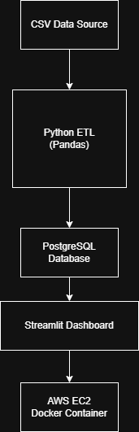
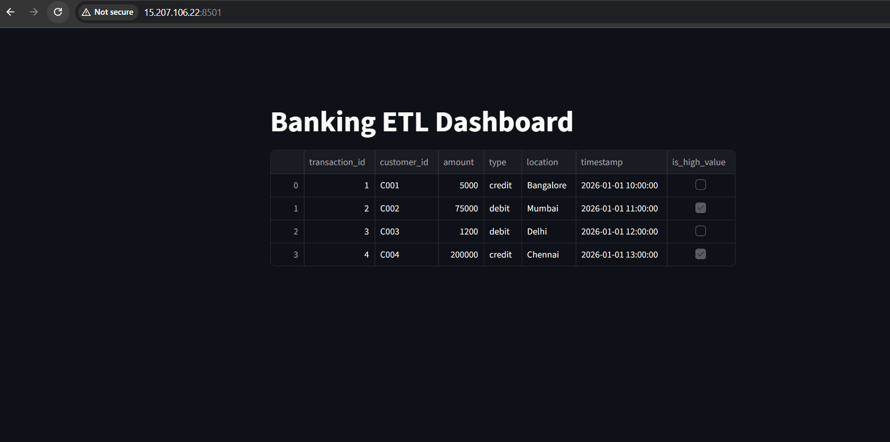
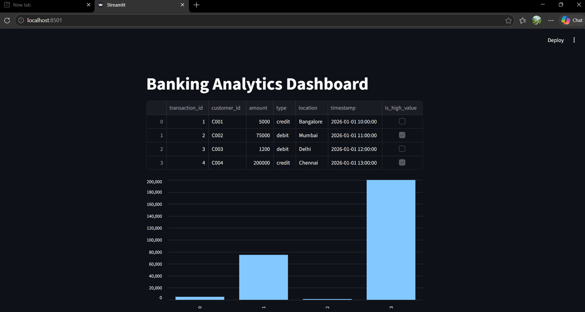
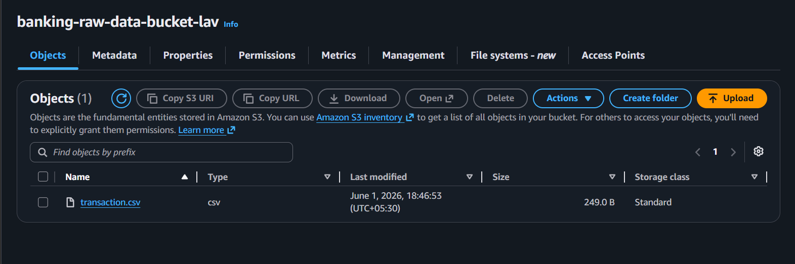
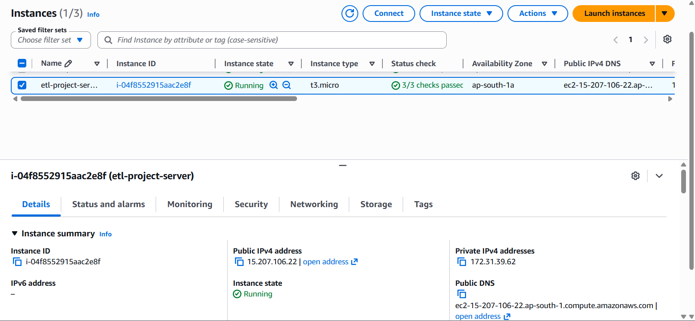

# Banking ETL Data Pipeline on AWS

## Project Overview

Built an end-to-end ETL (Extract, Transform, Load) pipeline that processes banking transaction data, stores it in PostgreSQL, and visualizes insights through a Streamlit dashboard. The application is containerized using Docker and deployed on AWS EC2.

## Problem Statement

Organizations generate large volumes of transaction data that need to be processed, stored, and analyzed efficiently. This project demonstrates how raw banking data can be transformed into meaningful information using a cloud-based ETL pipeline.

## Architecture

Data Source (CSV)
↓
Extract
↓
Transform
↓
PostgreSQL Database
↓
Streamlit Dashboard
↓
AWS EC2

## Technologies Used

* Python
* Pandas
* PostgreSQL
* SQLAlchemy
* Docker
* Streamlit
* Git & GitHub
* AWS EC2
* Linux

## Features

* Automated extraction of banking transaction data
* Data cleaning and transformation using Pandas
* Loading processed data into PostgreSQL
* Interactive Streamlit dashboard
* Dockerized application deployment
* Cloud hosting on AWS EC2
* Version-controlled using GitHub

## Project Structure

enterprise-data-pipeline/
├── data/
├── etl/
│   ├── extract.py
│   ├── transform.py
│   └── load.py
├── dashboard/
│   └── app.py
├── Dockerfile
├── requirements.txt
└── run_pipeline.py

## ETL Process

### Extract

Reads transaction data from source files.

### Transform

* Data cleaning
* Handling missing values
* Formatting columns
* Preparing data for analytics

### Load

Stores transformed data into PostgreSQL using SQLAlchemy.

## Deployment Process

1. Created AWS EC2 instance.
2. Installed Docker on EC2.
3. Cloned project from GitHub.
4. Built Docker image.
5. Deployed PostgreSQL container.
6. Deployed Streamlit application container.
7. Configured security groups and networking.
8. Accessed dashboard through public EC2 IP.

## Challenges Faced

### Docker Networking

The ETL container initially failed to connect to PostgreSQL due to container networking and hostname resolution issues.

### EC2 Security Configuration

Required proper inbound rules for SSH and Streamlit access.

### Disk Space Management

Docker images and build cache consumed available EC2 storage, causing build failures. Resolved through Docker cleanup and storage optimization.

### Database Connectivity

Troubleshot PostgreSQL connection issues using logs, container inspection, and SQLAlchemy configuration.

## Outcomes

* Successfully deployed an end-to-end ETL solution on AWS.
* Processed and stored transaction data in PostgreSQL.
* Visualized results through a web-based dashboard.
* Gained hands-on experience with cloud deployment, Docker, databases, and data engineering workflows.

## Key Learnings

* Docker containerization
* AWS EC2 deployment
* PostgreSQL administration
* Python data processing
* Streamlit dashboard development
* Git/GitHub collaboration
* Linux troubleshooting
* Cloud networking concepts

## Future Enhancements

* Apache Airflow for workflow scheduling
* AWS S3 integration for raw data storage
* CI/CD pipeline using GitHub Actions
* Monitoring with Prometheus and Grafana
* Docker Compose orchestration
* Data quality validation checks

# Banking ETL Data Pipeline

## Architecture

## Dashboard

## S3 Bucket

## EC2 Deployment

## Docker Containers

